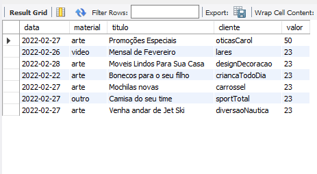

# Criando relatórios com HTML, CSS, PHP e MySQL

## Banco de dados:

## Na empresa onde trabalho, todo mês devemos fazer um relatório mensal de todos os trabalhos que fizemos (Artes, Vídeos e Etc), usávamos Excel para esse tipo de tarefas, porém, era muito desgastante ficar preenchendo inúmeras colunas por horas e horas manualmente!
## Então, tive a ideia de construir este programa com estrutura HTML, CSS, PHP e banco de dados MySQL.

## Este programa automatizou o processo da criação de relatórios, basta apenas você preencher os campos do formulário, clicar em "Adicionar" e pronto! Ele será adicionado direto ao banco de dados automaticamente nas suas colunas respectivas, e no final do mês, basta você baixar a planilha com todas as tarefas do mês, simples assim!

<h2>Tecnologias utilizadas:</h3>

<table>
<tr>
  <td>HTML5</td>
  <td>CSS3</td>
  <td>PHP</td>
  <td>MySQL</td>
</tr>
